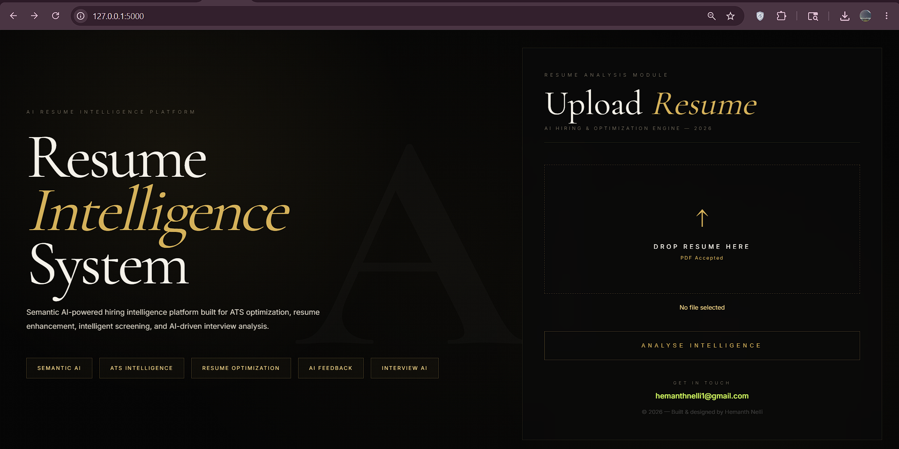
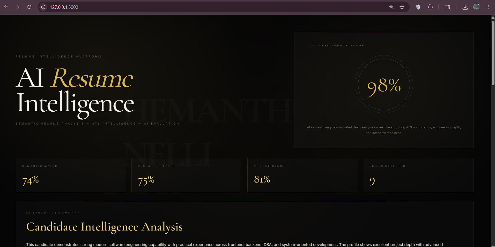

# Resume Intelligence Platform

A production-style AI-powered resume analysis platform designed to simulate modern ATS systems, semantic resume evaluation, and technical interview intelligence.

Built with Flask, Gemini AI, semantic scoring engines, and cinematic recruiter-grade UI architecture.

---

# Preview

## Landing Experience



## ATS Dashboard



## Interview Console


## Intelligence Dashboard
Advanced ATS evaluation with:
- semantic matching
- engineering profile analysis
- skill intelligence
- recruiter-style scoring
- interview simulation

---

# Core Features

### ATS Intelligence Engine
- Weighted resume scoring
- Semantic skill detection
- Resume structure evaluation
- Engineering keyword analysis
- Project depth scoring

### Resume Intelligence
- Technical profile analysis
- Missing skill detection
- Resume architecture validation
- Industry readiness evaluation

### Interview Intelligence
- AI-generated technical questions
- Interactive interview console
- Real-time technical assistant

### AI Integrations
- Gemini AI integration
- Ollama local inference support
- Semantic resume evaluation

---

# Technology Stack

## Frontend
- HTML5
- CSS3
- JavaScript

## Backend
- Flask
- Python

## AI Systems
- Gemini AI
- Ollama API

## Database
- SQLite

---

# System Architecture

```bash
resume-analyzer/
│
├── app.py
├── requirements.txt
├── skills.json
├── resume_ai.db
│
├── templates/
│   ├── index.html
│   └── result.html
│
├── uploads/
│
└── .gitignore
```

---

# Installation

## Clone Repository

```bash
git clone https://github.com/hemanthnelli1/Resume-intelligence-platform.git
```

## Navigate

```bash
cd Resume-intelligence-platform
```

## Install Dependencies

```bash
pip install -r requirements.txt
```

## Run Application

```bash
python app.py
```

---

# Platform Capabilities

- ATS Resume Scoring
- Semantic Resume Parsing
- Technical Skill Intelligence
- Recruiter-style Evaluation
- AI Interview Simulation
- Resume Optimization Insights
- Engineering Profile Detection

---

# Future Enhancements

- Resume PDF Export
- Recruiter Dashboard
- Authentication System
- Resume Comparison Engine
- AI Resume Rewrite Suggestions
- Cloud Deployment Analytics

---

# Author

Hemanth Nelli

GitHub:
https://github.com/hemanthnelli1

---
